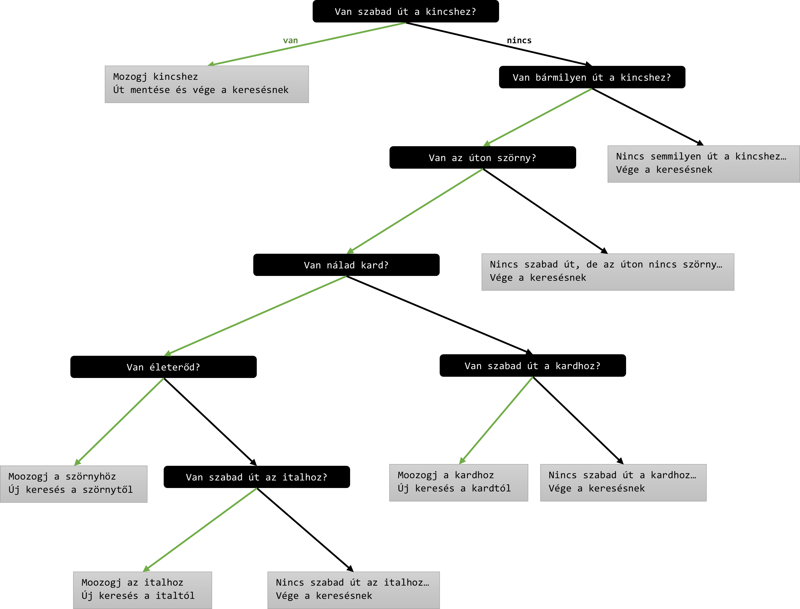

# Dokumentáció

## Adatok:

|                           |                        |
|---------------------------|------------------------|
| Név                       | Lapu Kornél            |
| E-mail                    | kornellapu@outlook.com |
|*Dátum*                    |*2023 április 13*       |

 

> **Figyelem!**  
> *Lehetséges, hogy a használt kódtáblák miatt az első és utolsó képernyők nem jelennek meg helyesen, ebben az esetben is működőképes az alkalmazás a használati útmutató szerint.*  
>
> *Játék közben a térképnek látszódnia kell minden esetben, így a játék játszható marad, rossz / hiányzó kódtábla mellett is!* 
> Azonban az interface-el baj lehet a speciális karakterek miatt...

 

> **Figyelem!**  
> *Csak ***Microsoft Windows*** operációs rendszeren működik az elkészített alkalmazás! (A használt könytárak miatt.)*

 

---

## Tartalom:

 

- [Tartalom](#tartalom)
- [Adatok](#adatok)
- [Esemény napló](#esemény-napló) (időrendi sorrendben)  
    - [Tervezés](#tervezés)
    - [Kódolás](#kódolás)
- [Használati útmutató](#használati-útmutató)  
    - [Gombok kiosztása](#gombok-kiosztása)
    - [Felhasználói felület / Játék képernyő](#felhasználói-felület--játék-képernyő)
- [Referencia](#referencia)  

 

---

## Esemény napló:

 

## Tervezés 
  
A feladat elolvasása után a játékmodell felépítésével kezdtem.  
Ezt a játék alapjának terveztem és vázlatként használtam fel a folyamatos fejlesztés során.  

  

**Kezdeti modell vázlat:**  

  

Generikus kollekciót használtam, a mezők tárolására, hiszen így egy helyen tárolhatóak.  
Ebben az esetben mutatókat használtam, hogy elkerüljem a szeletelődést.  
Így az érték szerinti átadással, csak egy sekély másolat készült a tároló objektumról, ami szándékom volt kezdetben, hogy csakis egy tároló legyen.

  

A későbbiek során kiegészítettem a központi osztályokat más segéd osztályokkal "interfészekkel" (absztrakt osztályokkal).  
Ilyen például egy kirajzolást segítő osztály.  
Emellett bekerült egy játék állapotát nyilvántartó osztály is, több más egyéb osztály mellett.  

   

---

## Kódolás

  

A kód elkészítését viszonylag korán a meglévő fontosabb osztályok megtervezése után kezdtem.  
Először csak a minimum szükséges osztályokra és kapcsolataikra fókuszáltam.  

Követtem a "**Clean Code**" elvet, ahol csak lehetett, kialakítva egy önmagát magyarázó kódot.  
Emellett objektum orientált programozási szemléletet használtam, tökrekedve arra, hogy minél egyszerűbb legyen a kód.  

Az elkészült alap funkciók után, kiegészítettem nem csak a játékhoz kapcsolódó képességekkel a programot: színes konzol, UTF-8 karakterek stb.  

Az alap játékban nem volt Mesterséges Intelligencia.  
Az összes elemet leteszteltem (a lehetőségeimhez mérten) és ha hibát találtam azokat kikerestem és javítottam.  
Az alap funkcióknak teljes mértékben működniük kell. (csapdák, potion, stb.)  

 

Az alapvető funkcionalitás után beletettem a **UI**-t.  

 

Utána pedig a **mesterséges intelligencia** implementáslása következett.  
Mivel még nem csináltam ilyet, ezt a rész élveztem a legjobban, de ez tartott a legtovább is.  

Először anyagot gyűjtöttem utána kis részfeladatokat megoldva egyre jobb AI-t sikerült összerakni.  
Elsőként a legrövidebb utat kereső algoritmust készítettem el: **A-csillag**.  
Majd utána az összes lehetséges út közül "**Goal Oriented Action Programming**"-al szerettem volna a legkedvezőbbeket kiválasztani. Ezt elkezdtem de végül kitöröltem, mivel úgy gondoltam egy egyszerű döntési fa is elég lesz, ilyen bonyolultságú játékhoz.  

 

**A végleges döntési fa logikája:**

  

Megpróbáltam a lehető legtöbb módon tesztelni a mesterséges intelligenciát, úgy hogy különböző pályákat készítettem kézzel és futattam rajta.  

 

Ezek közben és után foglalkoztam a **megjelenítéssel**.  
A kezdőképernyőre bekerült egy konzolos animáció, a meglévő ASCII képek mellé. Ezekhez természetesen a saját életemet könnyítő "tool"-okat meg kellett írnom.  

 

És természetesen magát a **dokumentációt** is elkészítettem.

---

 

## Használati útmutató

 

- ## Gombok kiosztása

A játék öt képernyőből áll:  
- kezdő
- játék
- vereség
- győzelem
- feladás

A játé indításakor a **kezdő** képernyő jelenik meg, ahol az "**ENTER**" billentyű megnynomására, a következő **játék** felületre kerülünk át.  

A játékban a **billentyűzet nyilai** segítségével lehet mozogni, négy irányba: **fel, le jobbra és balra**.  

Az "**ESC**" billentyű segítségével bármikor, véget lehet vetni a játéknak és be lehet zárni azt.

Az "**M**" billentyű megynomásával elindul az AI és egy kék hátterű "**?**" jelenik meg az útkeresési algoritmus futása közben.  
Miután lefutott még mindig kék háttérrel, elindul a hős a megtalált úton.  
Az "**M**" újboli megnyomásával bármikor leállítható az AI mozgása.  
Ha az AI nem talál utat kincshez akkor, azt a kétszer felvillanó kék hátterű "**!**" jelzi.  

Ha kincs nélkül kimegy a játékos a kijáraton, akkor feladás képernyőre kerül.  
Ha kincsel kimegy a kijáraton, akkor a győzelemre.
Ha pedig kard nélkül vagy sérülten, de karddal találkozik egy szörnnyel, akkor piros háttérrel jelezve a hős mögött megáll a játék és a vereség képernyőre kerül.  

A vereség, győzelem, feladás képernyőről a teljes szöveg kiírása után, **bármilyen billentyű**t lenyomva a program futása befejeződik.  

***Figyelem!  
A konzolos megjelenítés miatt, a képernyő villoghat mozgás közben!***

 

- ## Felhasználói felület / Játék képernyő

A játék során megtekinthető, hogy mit szerzett meg a hős: fegyvert és kincset.  
Emellett az is, hogy mennyi életereje van: szivek.

 

**Két különböző UI egymás alatt:**

  

Balról jobbra haladva a kardot jeleníti meg, középen az életerőt szivekként és végül pedig a kincset.  
Ha nem szereztük meg ezeket egy "**?**" kerül megjelenítésre.  

Alsó UI-on azok az ikonok láthatóak, amikor már megszerezte a hős a tárgyakat.  
Emellett a sebzést, azzel eggyel kevesebb szív jelzi.  

 

---

## Referencia

 

`enum Graphics`  
Tárolja a megjelenítéshez szükséges karaktereket.  
Azért lett enum, mivel egy karakter csak egy dolgot jelöl, így a karakterek kódja tökéletesen beleíllett az `enum`-ba.  

*Megjegyzés: Performancia okokból érdemesebb lehetne `const int`-be szervezni.*

 

`enum Direction`  
Tárolja az irányokat: fel, jobbra, lent és balra.  
Később bekerült még egy nem érvényes irány, de ezt végül nem használtam.  
A mező szomszédainak tömbjében indexként is használhatóak és jól fogja visszaadni, a megfelelő irányban található szomszédos mezőt  

 

`const bool enableColoring`  
A konzol szinezésére használt kapcsoló  

 

`enum Color`  
A konzol színeit tároló enum  

*Megjegyzés: ezek a színek átállíthatóak, változtathatóak konzolonként*

 

`const int CONSOL_WIDTH` és  `const int CONSOL_HEIGHT`  
A konzol a képernyőn megjelenített karaktereknek a száma (szélesség, magasság)

 

`const int TEXT_POS_X` és `const int TEXT_POS_Y`  
Az végső képernyőn megjelenített szöveg pozíciója

 

`const string pressKeyExitText`  
A végső képernyőkön pluszba megjelenített szöveg

 

`void showText(int x, int y, string text)`  
A végső képernyőkön használt szöveghez a megjelenítő függvény.  
Egyesével jeleníti meg akerektereket 100ms várakozással, a konzol x és y pozíciójától kezdve

 

`const int M_VKEY`  
A virtuális billentyűzethez használt érték, ami az M billentyűt reprezentálja  

 

`void showConsoleCursor(bool showFlag)`  
A konzol kurzor megjelenítése és eltüntetése.  
Nem szorosan kapcsolódik a használt osztályokhoz, ezért nem lett egységbe zárva

 

`void resizeConsolWindow(int width, int height)`  
A konzol ablak átméretezése

 

`void setConsolCursorTo(int line, int cloumn = 0)`  
A konzolon a curzort állítja paraméternek megadott sorban és oszlopban.  
Egy paraméterrel is használható, ekkor a sor elejére kerül a kurzor.

 

`void setConsolCursorToOnMap(int x, int y)`  
Beállítja a konzol kurzorját, de a térkép koordinátákat használva, tehát eltolja a megfelelő mértékkel.  
Így a mező koordinátáinak a segítségével könnyen át lehessen írni valamit a térképen/képernyőn (következő renderelésig)

 

`void setConsolColor(Color textColor, Color backgroundColor = Color::BLACK)`  
Konzol átszinezése, ha negedélyezve van.  
Bitshifteléssel előállított bitsorozattal előállítható a szöveg és a szöveg hátterének a színe

 

`string readFile(string filePath)`  
Beolvas egy fájl és string-é alakítja

 

`void waitAnyConsolKeyPress(int timeOffsetMilliSec = 0)`  
Megvárja amíg a paraméterben adott idő eltelik majd utána ellenőrzi, hogy érkezett-e billentyűlenyomás, ha igen akkor megy csak tovább  

 

`bool handleKeyInputs()`  
Az irányításhoz használt gombok lenyomásának ellenőrzése

 

`enum GameState`  
A játék állapotai  

 

`class Game`  
A játék osztály, ami a legmagasabb szinten kezeli a játék állapotát
Csak statikus mezői és függvényei vannak (singelton mintára)  
Tartalmazza és kezeli:  
- állapot
- térkép (játéktábla)
- user interface
- mesterséges intelligencia

 

`class Drawable`  
"Interface" osztály, ami a kirajzoláshoz az közös  őst.  
Absztakt osztály, mivel van tisztán virtuális függvénye

 

`class UIHeroInterface`  
A megjelenített interface állapotát tárolja és kirajzolható  

 

`class Tile`  
Egymással összekapcsolt mezők alkotják a játékteret.  
Van koordinátájuk, akönnyebb elérés és absztrakciók miatt.  
Szomszédok, jelen lévő hős és interakcióba léphető objektum is tárolásra kerül.  
Megjelenítéskor eldönti mi az amit megjelenít és amikor a hős rá akar lépni, akkor az itt tárol interakcióra képes tárggyal is ütközteti a hőst

 

`class Wall`  
Fal osztály, ami nem engedi, hogy a hős belépjen erre a mezőre

 

`class Trap`  
Csapda ami kezdetben árjárható, utána falként viselkedik

 

`class Exit`  
Kijárat amire rálépve véget ér a játék

 

`class Hero`  
Tárolja az életét, összegyűjtött kardot, kincset.
Rendelkezik pozícióval az aktuális térképről, ez a karakter mozgatható a négy irány valamelyikébe.

 

`class Interactable`  
Közös "interface" ősosztály, ami lehetővé teszi, hogy az egyes leszármazottaknak jelezni lehessen az ütközésről.
Absztrakt osztály, tisztán virtuális függvény miatt

 

`class Monster`   
Szörny osztály, megsebzi a hőst ha interakvióba lép vele

 

`class Weapon`  
Kard/fegyver osztály, lefveszi a hős ha interakcióba lép vele

 

`class Potion`  
Gyógyital osztály, ami meggyógyítja a hőst ha interakcióba lép vele

 

`class Treasure`  
Kincs osztály, amit szintén felvesz a hős ha interakcióba lép vele

 

`class Map`   
Térkép, ami tárolja az összes `Tile`-t, amit az adott fájlból olvas be
Ennek az osztálynak a feladata, hogy dinamikusan memóriát foglaljon és megsemmisítse a létrehozott `Tile` objektumokat.  
Generikus kollekcióként tárol több leszámazottat a `Tile`-ból.  
Mivel csak egy hős van, azért őt is eltárolja, a könnyebb hivatkozhatóság érdekében.  

 

`class HeroAI`  
A hőst irányító mesterséges intelligencia.  
Feladata megkeresni a legrövidebb utakat mozgatni a hőst a megfelelő irányba a kincs felé.  
Egy föntési fa alapján rekurzívan dönti el, hogy milyen útszakaszokból álló teljes utat rak össze.  
Két célpont között A-csillag algoritmust használ a legrövidebb út meghatározására.  
Képes mozgatni a hős karaktert

